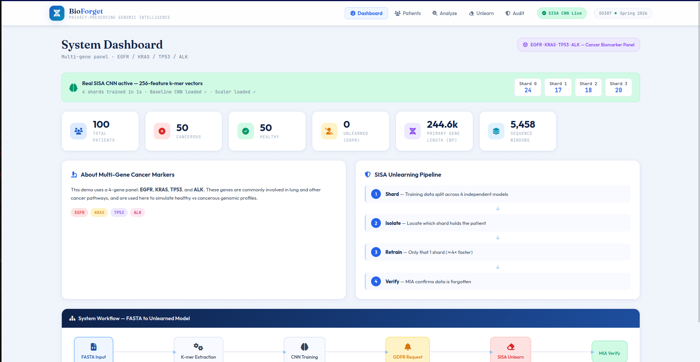
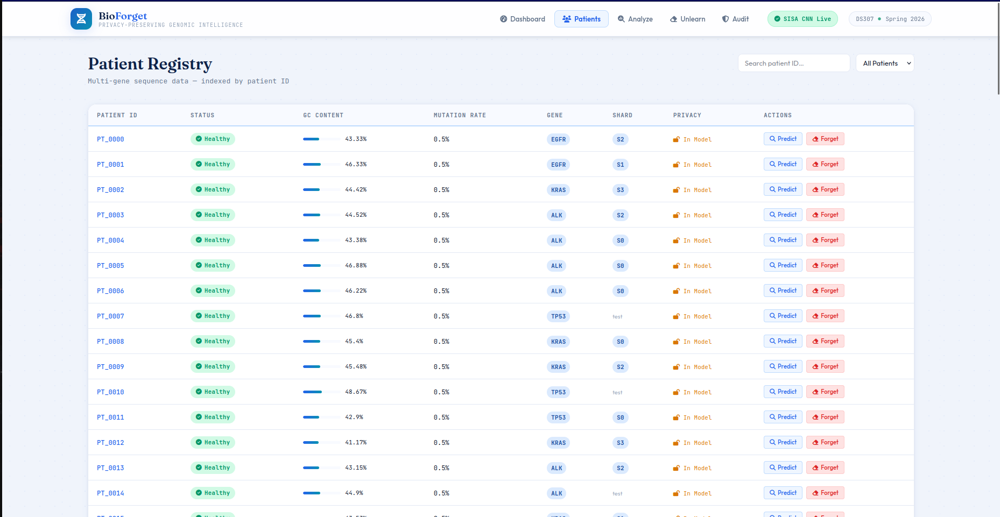
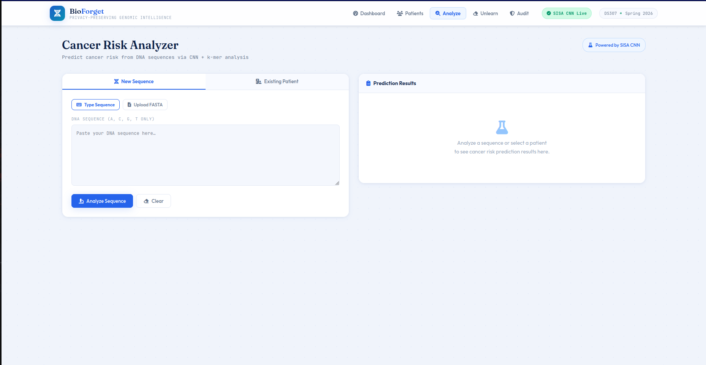
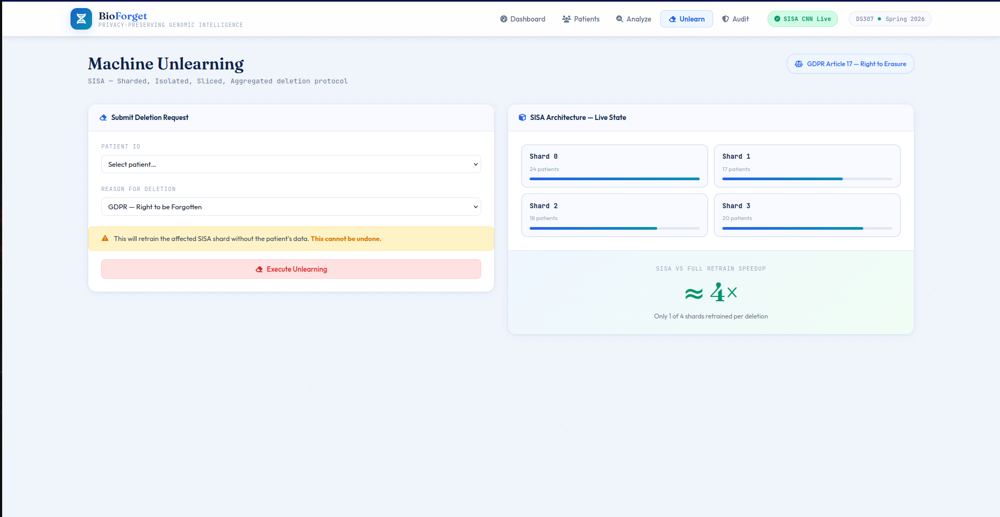
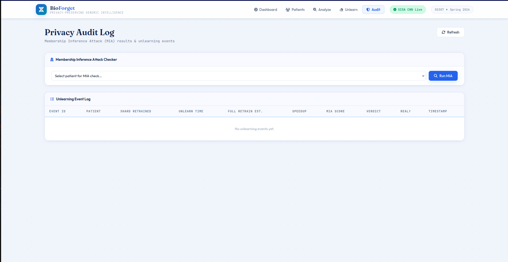

# 🧬 Bio-Forget: Privacy-Preserving Disease Detection via Machine Unlearning on Genomic Sequences

<p align="center">
  
</p>

<p align="center">
  
  
  
  
</p>

---

## 📖 Overview

**Bio-Forget** is an end-to-end bioinformatics system that identifies cancer-related mutations from raw DNA sequences in FASTA format, while supporting **GDPR-compliant Machine Unlearning**. When a patient invokes their *"Right to be Forgotten"*, the system removes their genetic influence from the AI model — **without retraining the entire dataset from scratch**.

---

## 🖼️ Screenshots

<p align="center">
  
  &nbsp;
  
</p>

<p align="center">
  
  &nbsp;
  
</p>

---

## 🔬 How It Works

```
Raw .fasta Files
       │
       ▼
Pre-processing & Vectorization (K-mer counting)
       │
       ▼
CNN Model Training (Cancerous / Healthy Classification)
       │
       ▼
[Trigger] Patient requests data deletion
       │
       ▼
SISA Machine Unlearning Algorithm
       │
       ▼
MIA Verification → Unlearned Model ✅
```

---

## 🚀 Features

- **FASTA Parsing** — High-speed parser for large `.fasta` files using Biopython
- **K-mer Feature Extraction** — Converts DNA strings (A, C, G, T) into 4-mer frequency vectors (256 features)
- **CNN Classifier** — Deep learning model to classify sequences as *Cancerous* or *Healthy*
- **SISA Unlearning** — Sharded, Isolated, Sliced, and Aggregated modular deletion (4 shards)
- **MIA Verification** — Membership Inference Attacks to prove a patient's data has truly been forgotten
- **Web Dashboard** — Interactive Flask + vanilla JS interface to manage patients and trigger unlearning

---

## 📁 Project Structure

```
Bio-Forget/
├── app.py                        # Flask backend
├── generate_multigene_data.py    # Dataset & model generator
├── Bio_unlearning.ipynb          # Research notebook
├── index.html                    # Frontend UI
├── app.js                        # Frontend logic
├── style.css                     # Styling
├── Data/
│   ├── EGFR.fasta                # Reference gene (user-provided)
│   ├── KRAS.fasta                # Auto-synthesised
│   ├── TP53.fasta                # Auto-synthesised
│   ├── ALK.fasta                 # Auto-synthesised
│   ├── patients_db.json          # 100 patients with k-mer vectors
│   ├── scaler_params.json        # StandardScaler mean/scale
│   ├── shard_map.json            # Patient → shard mapping
│   └── mia_thresholds.json       # MIA configuration
├── egfr_classifier.pth           # Trained CNN weights
└── images/                       # README assets
```

---

## ⚙️ Installation

```bash
# Clone the repository
git clone https://github.com/<your-username>/Bio-Forget.git
cd Bio-Forget

# Install dependencies
pip install torch biopython scikit-learn flask numpy

# Place your EGFR.fasta file inside the Data/ folder, then generate data
python generate_multigene_data.py --train-cnn

# Run the web app
python app.py
```

Then open `http://localhost:5000` in your browser.

---

## 🧪 Generating the Dataset

```bash
# Generate data only
python generate_multigene_data.py

# Generate data AND train the CNN model
python generate_multigene_data.py --train-cnn

# Use a custom data directory
python generate_multigene_data.py --data-dir MyData --train-cnn
```

This generates **100 patients** (50 healthy / 50 cancerous) across 4 genes: `EGFR`, `KRAS`, `TP53`, `ALK`.

---

## 🤖 Model Architecture

The `EGFRClassifier` is a 1D CNN trained on 4-mer frequency vectors:

| Layer | Details |
|-------|---------|
| Input | 256-dim k-mer frequency vector |
| Conv1 | 32 filters, kernel=5, BN + ReLU + MaxPool |
| Conv2 | 64 filters, kernel=3, BN + ReLU + MaxPool |
| FC | 64×64 → 128 → Dropout(0.4) → 2 |

Training uses **AdamW + CosineAnnealingLR** with label smoothing for 100 epochs.

---

## 🗑️ Machine Unlearning (SISA)

Patients are assigned to one of **4 shards** at training time. When a deletion request is triggered:

1. Identify which shard(s) contain the patient's data.
2. Retrain **only** the affected shard from scratch.
3. Re-aggregate all shard models.
4. Verify forgetting via **Membership Inference Attack (MIA)**.

This is significantly faster than full retraining on the entire dataset.

---

## 🔐 Privacy Verification (MIA)

After unlearning, a Membership Inference Attack is performed. A forgotten patient should have a confidence score near the **random baseline (~0.52)**, well below the membership threshold.

| Threshold | Meaning |
|-----------|---------|
| > 0.52 | Likely still memorized |
| < 0.15 | Partially forgotten |
| < 0.08 | Fully forgotten ✅ |

---

## 📊 Performance Comparison

| Method | Time | Accuracy Impact |
|--------|------|----------------|
| Full Retraining | ~100 epochs on all data | Baseline |
| SISA Unlearning | ~100 epochs on 1 shard | Minimal degradation |

---

## 🎥 Demo & Presentation

> 📹 **[Watch the Demo and Presentation on Google Drive](https://drive.google.com/drive/folders/1svblr6owJ0u8Exx_5UO09LT6Z27TETx3?usp=sharing)**

---

## 👥 Team

| # | Name |
|---|------|
| 1 | Mahmoud Saeed |
| 2 | Salah Eldin Mostafa |
| 3 | Abdelrahman Mohammed Ali |
| 4 | Mina Saher |
| 5 | Abdelrahman Mohammed Shokry |
| 6 | Omar Wael |
| 7 | Mahmoud Hisham |
| 8 | Youssef Abdel-Ghafar |
| 9 | Eyad Akram |
| 10 | Amr Khaled |

---

## 📜 License

This project is for educational purposes only. Genomic data used is either synthesised or publicly available.
